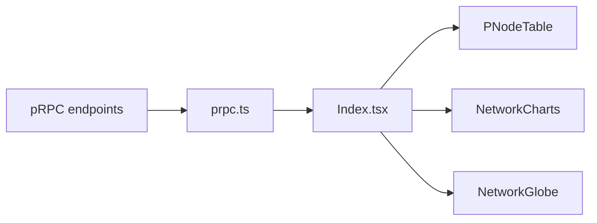

# Architecture

High-level
- Data flow: pRPC endpoints → `src/lib/prpc.ts` → `Index.tsx` (app state) → UI components (`PNodeTable`, `NetworkCharts`, `NetworkStats`, `Globe`).

Components (summary)
- `src/pages/Index.tsx` — orchestrates fetch, filters, and mode (table/grid) rendering.
- `src/components/PNodeTable.tsx` — table rendering, sorting, pagination, CSV/JSON export.
- `src/components/NetworkCharts.tsx` — chart visualizations.
- `src/components/NetworkGlobe.tsx` / `Globe.tsx` — 3D globe visualization (Three.js) with click-to-filter events.
- `src/lib/prpc.ts` — fetch helpers, retry/backoff, credit merging.

Diagram (mermaid)

Key files to inspect
- `src/lib/prpc.ts`, `src/pages/Index.tsx`, `src/components/PNodeTable.tsx`.
